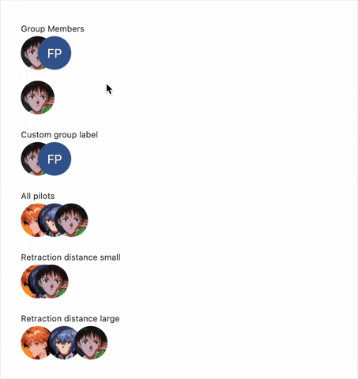
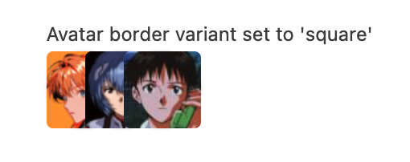

# User Group Avatar LWC

  

This repository contains a Lightning Web Component (LWC) that displays the avatar of a user group in Salesforce. The component fetches and displays the avatar based on the provided group record ID.

And of course there's a square variant:

## Features

Display the avatars of group members.

- Fetch group details by group id or group API name.
- Control the count of avatars displayed.
- Customize the retraction distance between avatars.

## License

This project is licensed under the BSD 3-Clause License. See the [LICENSE](LICENSE) file for details.
